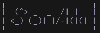

A perlin noise animation in your terminal written in Ada.

See [`NOTES.md`](./NOTES.md) for advancement.

## Building from sources

The build depends on `curl` and `unzip`. The [Alire](https://github.com/alire-project/alire) cli is also needed but will be downloaded locally if not present.

```bash
git clone --depth 1 https://github.com/sully-vian/sonada.git && cd sonada && make
```

